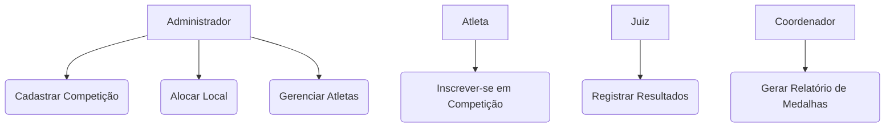
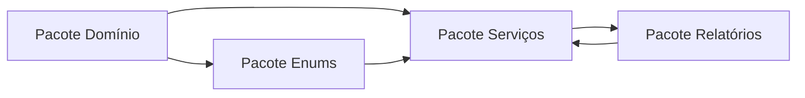
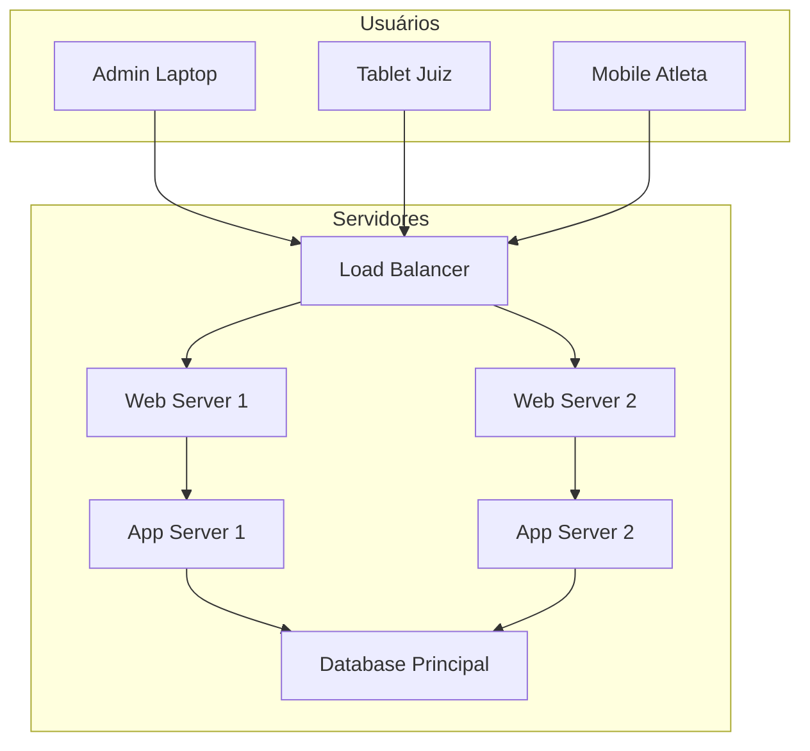

# 🏅 Sistema de Gestão das Olimpíadas (SGO)

> Projeto desenvolvido como parte da disciplina **Projeto de Software** (4º período de Engenharia de Software) – Professor João Paulo Carneiro Aramuni.

O **Sistema de Gestão das Olimpíadas (SGO)** tem como objetivo centralizar e gerenciar as principais atividades das Olimpíadas, como o **cadastro de competições**, **inscrição de atletas**, **alocação de locais**, **registro de resultados** e **geração de relatórios de medalhas**.

---

## 🎯 Objetivos do Sistema

- Permitir o **gerenciamento completo das competições olímpicas**;
- Controlar **inscrições de atletas** e vinculação aos respectivos países;
- Garantir a **disponibilidade e alocação de locais** sem conflitos de horários;
- Registrar **resultados e classificações automáticas**;
- Gerar **relatórios analíticos de desempenho** e **ranking de medalhas** por país.

---

## 🧩 Estrutura do Repositório

```

📁 Sistema-Gestao-Olimpiadas/
┣ 📁 imagens/
┃ ┣ diagrama_de_caso_de_uso.jpg
┃ ┣ diagrama_de_classes.jpg
┃ ┣ diagrama_de_pacotes.jpg
┃ ┣ diagrama_de_pacote_simplificado.jpg
┃ ┣ diagrama_de_componentes.jpg
┃ ┗ diagrama_de_implantacao.jpg
┣ 📁 modelagens/
┃ ┣ diagrama_de_caso_de_uso.drawio
┃ ┣ diagrama_de_classes.drawio
┃ ┣ diagrama_de_pacotes.drawio
┃ ┣ diagrama_de_componentes.drawio
┃ ┗ diagrama_de_implantacao.drawio
┗ 📄 README.md

````

---

## 👤 Histórias de Usuário

| ID | História de Usuário | Prioridade |
|----|----------------------|-------------|
| **US01** | Como **administrador**, desejo cadastrar novas competições informando modalidade, data, horário e local, para organizar o cronograma de eventos. | Alta |
| **US02** | Como **atleta**, quero me inscrever em competições específicas, representando meu país, para participar das Olimpíadas. | Alta |
| **US03** | Como **administrador**, desejo alocar locais para competições de modo que não ocorram conflitos de horário. | Alta |
| **US04** | Como **juiz**, quero registrar resultados e classificações, para atualizar o quadro de medalhas automaticamente. | Alta |
| **US05** | Como **coordenador**, quero gerar relatórios de medalhas por país, para analisar o desempenho geral nas Olimpíadas. | Média |

---

## 🧠 Regras de Negócio

1. **Cadastro de Competições:** Cada competição deve conter modalidade, data, local e lista de atletas.  
2. **Inscrição de Atletas:** Um atleta pode participar de várias competições, mas representa **apenas um país** em cada modalidade.  
3. **Alocação de Locais:** Um local só pode sediar **uma competição por vez**.  
4. **Registro de Resultados:** Após a competição, são atribuídas medalhas de **ouro**, **prata** e **bronze**.  
5. **Relatórios de Medalhas:** O sistema gera automaticamente o **ranking por país**.  


## 🧭 Mini Diagramas em Mermaid

### 🎭 Caso de Uso (Simplificado)



### 🧱 Estrutura de Pacotes



### 🖥️ Implantação (Simplificada)



---

## 💡 Diferenciais do Projeto

✅ **Completude UML:** Contém **todos os 5 diagramas obrigatórios** (caso de uso, classes, pacotes, componentes e implantação).
✅ **Organização Modular:** Uso de pacotes bem definidos (`domínio`, `serviços`, `relatórios`, `enums`).
✅ **Diagrama de Pacotes Simplificado** adicional para melhor legibilidade.
✅ **Consistência entre camadas** (interface, serviços, domínio e persistência).
✅ **Diagrama de Implantação** realista, com redundância de servidores, cache e backup.
✅ **README documentado e visual**, com **mini diagramas Mermaid** integrados.

---

## 🧾 Autores

**👨‍💻 Paulo Henrique Fonseca de Assis**
**👨‍💻 Áulus Arcanjo Alves Batista**
Estudante de Engenharia de Software – 4º Período
📍 Desenvolvido para a disciplina de **Projeto de Software**


```
